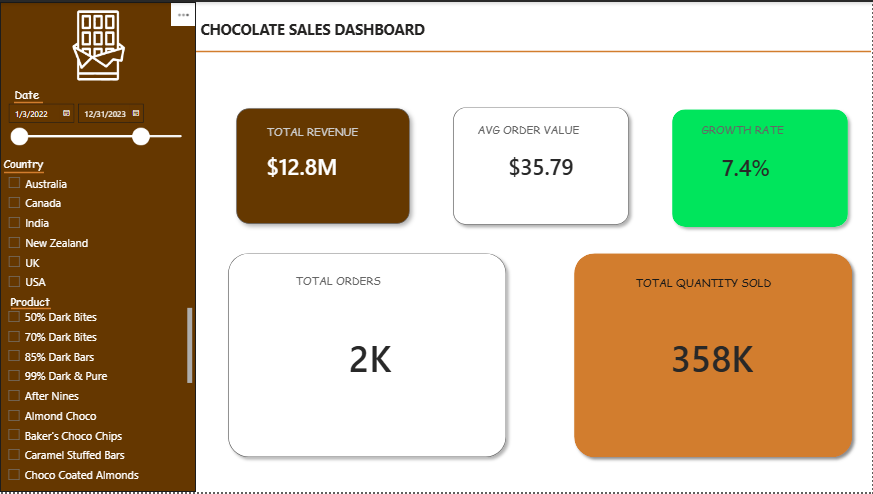

# Power BI Capstone Project: Chocolate Sales Dashboard

## 🎯 Objective
The primary goal of this project is to analyze chocolate sales performance across multiple dimensions, including time, product category, geographical region, and individual salespersons. This dashboard provides stakeholders with clear, centralized business intelligence to understand revenue trends, identify top-performing products, and evaluate team performance.

## 📊 Dashboard Overview
The Power BI report is divided into focused analytical sections to provide step-by-step insights:

* **Executive Overview:** High-level KPI cards tracking Total Revenue, Total Quantity Sold, Total Orders, and Average Order Value.
* **Time-Based Analysis:** Line and column charts identifying seasonal trends, revenue growth, and historical performance over time.
* **Product Performance:** Visual breakdowns of the top 10 best-selling products and revenue contribution by category to pinpoint market drivers.
* **Regional Performance:** Geographical revenue mapping and column charts comparing high-performing and underperforming locations.
* **Salesperson Performance:** Individual performance tracking to highlight the top 5 contributors to total revenue.
* **Dynamic Filtering:** Interactive slicers for Date, Region, Product, and Salesperson to allow for customized data drill-downs.

## 📸 Dashboard Preview

## 🛠️ Technical Implementation
This project was built using strict data modeling and advanced DAX principles.

* **Data Modeling:** Established a robust relational data model, including a dedicated and connected Calendar Table for precise time-intelligence calculations.
* **DAX Measures:** Authored complex DAX measures to calculate core business metrics, including:
  * Total Revenue
  * Total Quantity
  * Total Orders
  * Average Order Value
  * Year-Over-Year / Monthly Growth

## 💡 Key Business Insights
After cleaning, modeling, and visualizing the dataset, the following concrete insights were extracted:

* [cite_start]**Insight 1:** Total revenue for the period stood at $12.8 million, with an average order value of $35.79, indicating consistent mid-range transaction sizes across all regions and products[cite: 13].
* [cite_start]**Insight 2:** 2023 outperformed 2022 across all months analyzed[cite: 14]. [cite_start]Revenue was consistently higher in 2023, suggesting positive business growth year over year[cite: 14].
* [cite_start]**Insight 3:** Smooth Silky Salty was the top revenue-generating product at $723.3K, while 50% Dark Bites led in quantity shipped, suggesting it is a high-volume but lower-priced product[cite: 16].
* [cite_start]**Insight 4:** Australia was the strongest performing region, leading in both total revenue at $2.4M and boxes shipped at over 66,000 units, making it the most valuable market in the dataset[cite: 17].
* [cite_start]**Insight 5:** Ches Bonnell was the top salesperson by revenue at $661,770, while Kelci Walkden led in total orders at 108, showing different strengths among the top performers[cite: 18].

## 📂 Files Included
* `dashboard3.pbix` - The core Power BI project file containing the data model, DAX measures, and interactive visuals.
* Dashboard Screenshots - High-resolution images of the report pages for quick viewing.
* `dashboard3pdf.pdf` - A complete export of the dashboard views.

---
*Created as a capstone project to demonstrate proficiency in Power BI, DAX, and data modeling.*